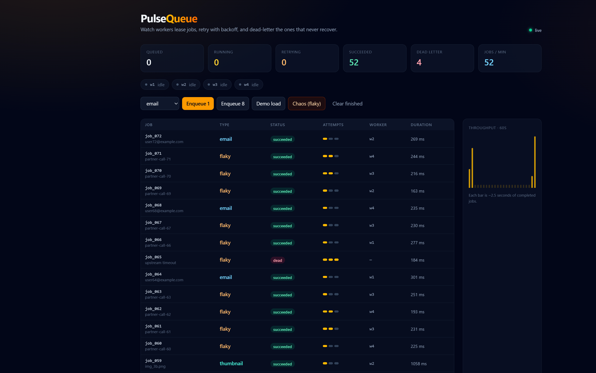

# PulseQueue

**Watch a job queue work in real time — workers, retries, dead letters, and throughput.**


Enqueue a batch, then watch four workers lease jobs, retry the flaky ones with exponential backoff, and park the rest in a dead-letter queue. Built to make backend queue semantics *visible*.

**Live:** [pulsequeue-wokz.onrender.com](https://pulsequeue-wokz.onrender.com)



## What it demonstrates

- **Lease / complete / fail** — a job is only ever owned by one worker
- **Exponential backoff** — failed jobs become eligible again at `base * 2^(attempts-1)`
- **Dead-letter queue** — after `maxAttempts`, the job stops cycling and is marked `dead`
- **Live dashboard** — Server-Sent Events push every state change; the UI never polls

```
Browser ──SSE /api/events──► Express
   │                         │
   │  POST /api/jobs         │  WorkerPool (4 loops)
   └────────────────────────►│     lease → execute → complete/fail
                             │
                      JobQueue (pure TS)
                      FIFO + backoff + DLQ
```

The queue engine (`server/src/queue.ts`) has no HTTP, no timers, and no workers — the clock is injected — so lease exclusivity, retry delay, and dead-lettering are covered by unit tests.

## Quickstart

```bash
# Terminal 1 — API + workers on :3002
cd server
npm install
npm run dev

# Terminal 2 — Vite on :5173, proxies /api to the server
cd web
npm install
npm run dev
```

Open http://localhost:5173 and click **Demo load**.

### Production

The live site is a long-running Node process on [Render](https://render.com) (`render.yaml`). Free instances sleep after idle time, so the first request after a pause can take ~30s.

```bash
npm install
npm run build
npm start
```

That serves the built frontend and the API from one port (`PORT`, default 3002). Scale workers with `WORKERS=8`.

## Tests

```bash
cd server
npm test
```

Covers FIFO leasing, single-owner complete/fail, exponential backoff, dead-lettering, event order, history pruning, and clearing terminal jobs.

## Tech stack

| Layer    | Choices                                              |
| -------- | ---------------------------------------------------- |
| Frontend | React 19, TypeScript, Vite, Tailwind CSS 4           |
| Backend  | Node.js, Express, Server-Sent Events                 |
| Core     | In-memory job queue (lease, backoff, dead-letter)    |
| Testing  | Vitest                                               |
| CI       | GitHub Actions — server tests + web type-check/build |

## License

[MIT](LICENSE)
